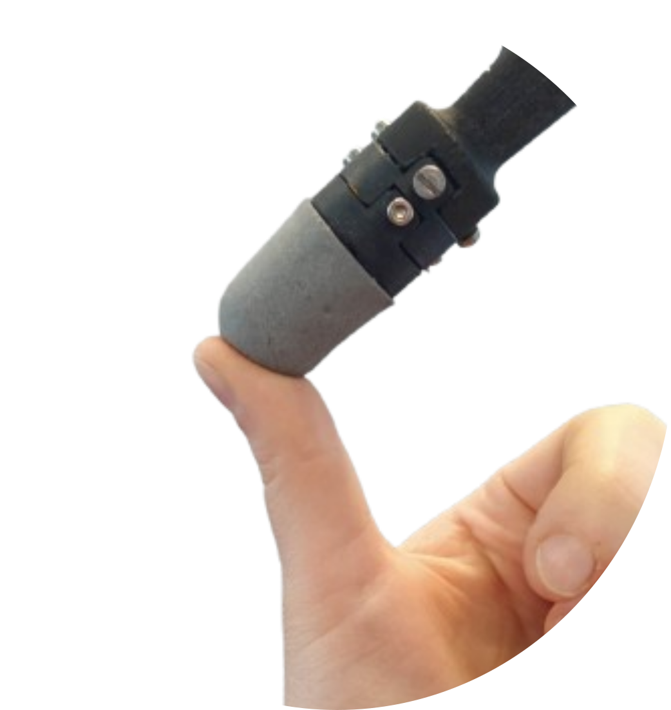

# Minsight: A Fingertip-Sized Vision-Based Tactile Sensor for Robotic Manipulation
<p align="right">
  *This is the only official content release regarding the design of Minsight.*
</p>

This project shows the principle desing of [Minsight](https://onlinelibrary.wiley.com/doi/full/10.1002/aisy.202300042). It is a soft fingertip-sized tactile sensor that can sense 3D forces over its whole sensing surface.

The corresponding paper is titled "[Minsight: A Fingertip-Sized Vision-Based Tactile Sensor for Robotic Manipulation](https://onlinelibrary.wiley.com/doi/full/10.1002/aisy.202300042)", published at *Advanced Intelligent Systems*, 2023. 

<p align="center">
  
This work was done by Iris Andrussow, Huanbo Sun, Katherine J. Kuchenbecker, Georg Martius at the Max Planck Institute for Intelligent Systems.
  
If you use our work, please use the citation information [below](#Citation).
  
# Abstract
Intelligent interaction with the physical world requires perceptual abilities beyond vision and hearing; vibrant tactile sensing is essential for autonomous robots to dexterously manipulate unfamiliar objects or safely contact humans. Therefore, robotic manipulators need high-resolution touch sensors that are compact, robust, inexpensive, and efficient. The soft vision-based haptic sensor presented herein is a miniaturized and optimized version of the previously published sensor Insight. Minsight has the size and shape of a human fingertip and uses machine learning methods to output high-resolution maps of 3D contact force vectors at 60 Hz. Experiments confirm its excellent sensing performance, with a mean absolute force error of 0.07 N and contact location error of 0.6 mm across its surface area. Minsight's utility is shown in two robotic tasks on a 3-DoF manipulator. First, closed-loop force control enables the robot to track the movements of a human finger based only on tactile data. Second, the informative value of the sensor output is shown by detecting whether a hard lump is embedded within a soft elastomer with an accuracy of 98\%. These findings indicate that Minsight can give robots the detailed fingertip touch sensing needed for dexterous manipulation and physical human–robot interaction.

# Working Mechanism

Minsight is a vision-based tactile sensor. Is uses a camera as the transducer and can detect small deformations of an elastic shell from the inside. To create 3D forces, we use the photometric stereo effect to learn an end-to-end mapping of camera image to a force map over the full sensor surface. 
  
Insert video here
  

# Mechanical Components

Our hybrid structure of a soft elastomer shell enclosing a stiff metal skeleton ensures high sensitivity and robustness. The soft elastomer is for detecting light contact with high sensitivity. The metal skeleton is for holding the elastomer’s global shape and sustaining high-impact forces.

<p align="center">

 

## Elastomer Shell
- 3D Printer: [Formlabs Form 3](https://formlabs.com/eu/3d-printers/form-3/)
- 3D Printing Material: [Tough Resin FLTOTL05](https://formlabs.com/store/tough-2000-resin/). *Note: The material is updated.*
- Mold Design: 
  - [Mold](CAD/Mold/)
- Elastomer Material:
  - [EcoFlex 00-30](https://www.smooth-on.com/products/ecoflex-00-30/)
  - [Aluminum Powder 65 Micrometer, 99% Pure](https://www.amazon.de/Aluminumpulver-Aluminium-Pulver-Alupulver-Zus%C3%A4tze/dp/B06WRTGP2Y)
  - [Aluminum Flake 75 Micrometer](https://www.metallpulver24.de/de/aluminiumpulver-flaky-silber.html)
- [Vacuum Chamber VP1100, 5 Pa](https://www.silikonfabrik.de/vakuumtechnik/komplettsysteme/vakuum-komplettsystem-vks27/vp1200-vakuumkammer-und-pumpe.html). *Note: The Pump is updated.*
       
## Metal Skeleton
- 3D Printer: [ExOne X1 25 Pro](https://www.exone.com/en-US/Resources/News/X1-25PRO)
- 3D Printing Material: [AlSi10Mg-0403 Alluminum Alloy](https://www.shapeways.com/materials/aluminum) *Note: The material is updated.*
- Geometry Design: [Skeleton](CAD/skeleton.STEP)
- Printing Service: [Shapeways](https://www.shapeways.com/)
       
## Camera Holder and Sensor Base
- 3D Printer: [Formlabs Form 3](https://formlabs.com/eu/3d-printers/form-3/)
- Material: [Standard Black](https://formlabs.com/de/shop/black-resin/)
- Design: [Holder](CAD/camera_holder.STEP)
          [Base](CAD/sensor_base.STEP)
      
## Imaging System


### Camera

- [ MISUMI YD-B31111LH-158A-03 with Connector and USB 3.0](https://www.misumi.com.tw/en/about/aboutus)

### LED Ring
- LEDS: [Würth Elektronik SMD LEDs 150044M155220](https://www.mouser.de/ProductDetail/Wurth-Elektronik/150044M155220?qs=rQFj71Wb1eUvmcUtzGYYDA%3D%3D)
- PCB Design: [PCB/led_layout]
- Example Supplier: [Beta Layout](https://de.beta-layout.com/leiterplatten/)
     

### Collimator
- 3D Printer: [Formlabs Form 3](https://formlabs.com/eu/3d-printers/form-3/)
- Material: [Standard Black](https://formlabs.com/de/shop/black-resin/)
- Geometry Design: [Collimator](CAD/collimator.STEP)

# Calibration
We use a custom test bed to calibrate the sensor in a controlled way, collecting both normal and shear forces.
For the technical details of this test bed, please refer to the Testbed section in the Insight Documentation [here](https://github.com/Huanbo-Sun/Haptics-for-Robots-Insight/blob/master/README.md#testbed)
   <p align="center"> 

# Software
Insight constantly records images from inside using a camera. Feeding these images and a reference image into a trained machine learning model makes it possible to estimate the force distribution all over a surface. Each pixel in the force prediction map has three values that indicate the force strength in three directions (x, y, and z). In a force visualization on the right, each point corresponding to each pixel in the force map shows the force distribution of the contact in both normal and shear directions.

We provide ROS nodes to run Minsight [here](Code/) 


# Citation
Please use the following citation if you make use of our work:
## BibTex
``` citation
@article{https://doi.org/10.1002/aisy.202300042,
author = {Andrussow, Iris and Sun, Huanbo and Kuchenbecker, Katherine J. and Martius, Georg},
title = {Minsight: A Fingertip-Sized Vision-Based Tactile Sensor for Robotic Manipulation},
journal = {Advanced Intelligent Systems},
volume = {5},
number = {8},
pages = {2300042},
doi = {https://doi.org/10.1002/aisy.202300042},
url = {https://onlinelibrary.wiley.com/doi/abs/10.1002/aisy.202300042},
year = {2023}
}
```
### RIS
``` citation
TY  - JOUR
T1  - Minsight: A Fingertip-Sized Vision-Based Tactile Sensor for Robotic Manipulation
AU  - Andrussow, Iris
AU  - Sun, Huanbo
AU  - Kuchenbecker, Katherine J.
AU  - Martius, Georg
PY  - 2023
DO  - https://doi.org/10.1002/aisy.202300042
JO  - Advanced Intelligent Systems
JA  - Adv. Intell. Syst.
SP  - 2300042
VL  - 5
IS  - 8
PB  - John Wiley & Sons, Ltd
SN  - 2640-4567
UR  - https://doi.org/10.1002/aisy.202300042
Y2  - 2024/09/16
```    
       
       
 
       
    